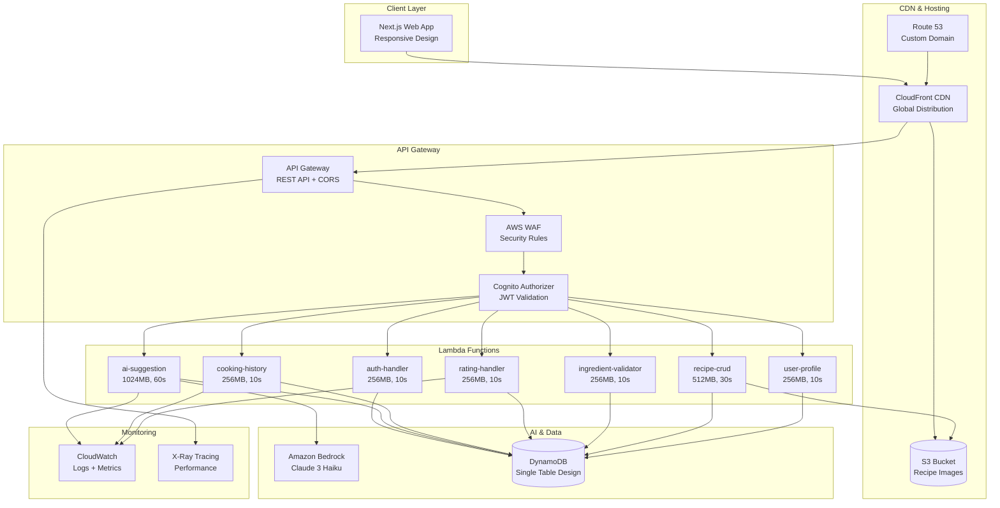
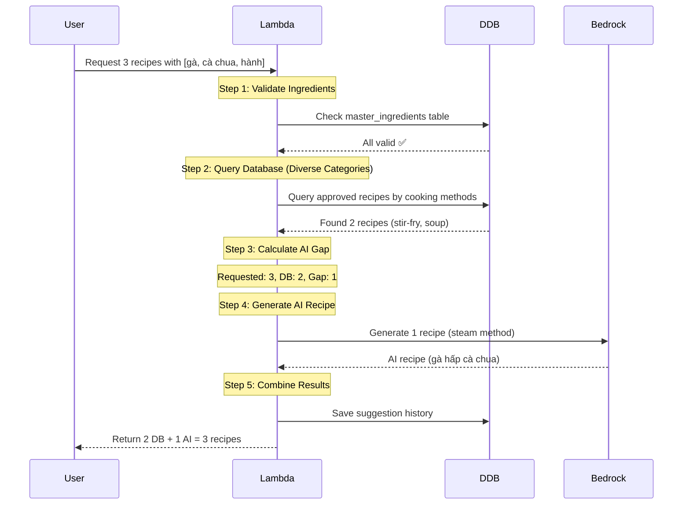
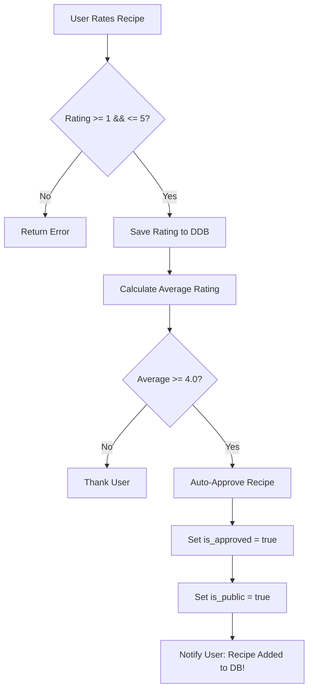
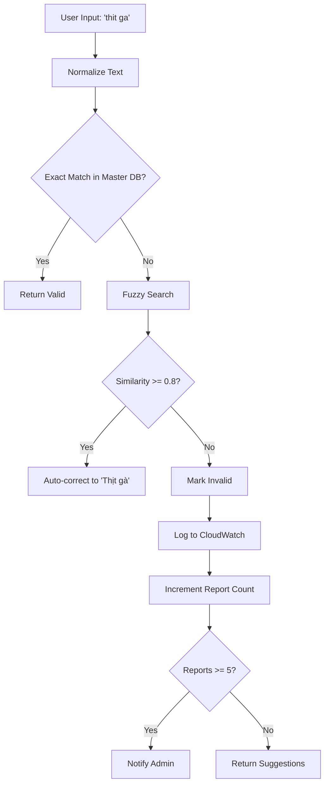
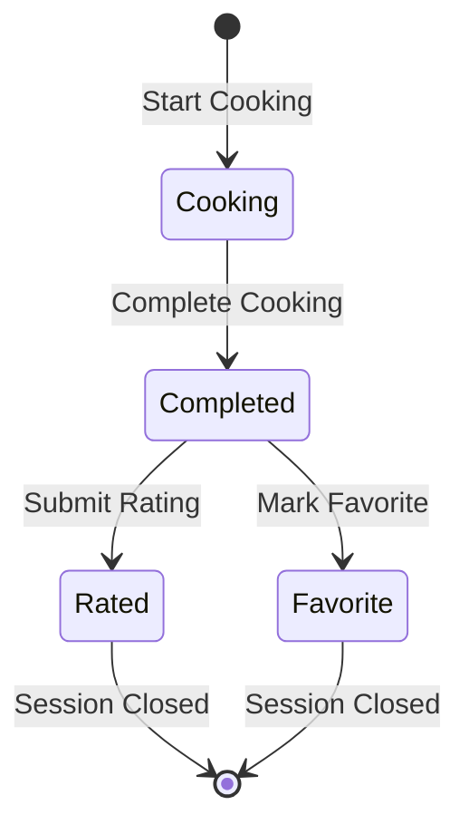
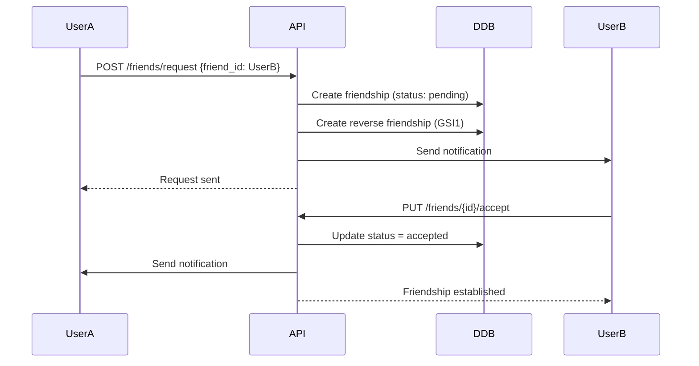

# Design Document - Smart Cooking MVP

## Overview

Smart Cooking MVP là một ứng dụng nấu ăn thông minh sử dụng kiến trúc serverless trên AWS với AI engine để gợi ý công thức dựa trên nguyên liệu có sẵn. Hệ thống áp dụng chiến lược flexible mix giữa database và AI generation để tối ưu chi phí và chất lượng, kết hợp với community-driven auto-approval system.

## Architecture

### High-Level Architecture



### Technology Stack

**Frontend:**
- Framework: Next.js 14 (React-based)
- Styling: Tailwind CSS + shadcn/ui components
- State Management: React Context + useState/useEffect
- HTTP Client: Fetch API with custom wrapper
- Authentication: AWS Cognito SDK

**Backend:**
- Runtime: Node.js 20 (AWS Lambda)
- Database: Amazon DynamoDB (single-table design)
- AI: Amazon Bedrock (Claude 3 Haiku)
- Authentication: Amazon Cognito User Pools
- File Storage: Amazon S3
- API: AWS API Gateway (REST)

**Infrastructure:**
- Hosting: S3 Static Website + CloudFront CDN
- Domain: Route 53 Custom Domain
- Security: AWS WAF
- Monitoring: CloudWatch + X-Ray
- Deployment: AWS CDK

## Components and Interfaces

### 1. AI Suggestion Engine (Core Component)

**Purpose:** Flexible mix strategy combining database recipes with AI-generated recipes

**Interface:**
```typescript
interface AISuggestionRequest {
  ingredients: string[];
  recipe_count: number; // 1-5
}

interface AISuggestionResponse {
  suggestions: Recipe[];
  stats: {
    requested: number;
    from_database: number;
    from_ai: number;
  };
  warnings: ValidationWarning[];
}
```

**Algorithm Flow:**


**Key Features:**
- **Cost Optimization:** Prioritize database recipes over AI generation
- **Category Diversity:** Ensure different cooking methods (xào, canh, hấp, chiên)
- **Personalization:** Use user profile for AI context (age, gender, country, allergies)
- **Graceful Degradation:** Return database recipes if AI fails

### 2. Auto-Approval System

**Purpose:** Community-driven recipe approval based on ratings

**Interface:**
```typescript
interface RatingRequest {
  recipe_id: string;
  rating: number; // 1-5
  comment?: string;
  history_id?: string;
}

interface RatingResponse {
  success: boolean;
  average_rating: number;
  rating_count: number;
  auto_approved: boolean;
  message: string;
}
```

**Auto-Approval Logic:**


### 3. Ingredient Validation System

**Purpose:** Validate user input against master ingredients with fuzzy matching

**Interface:**
```typescript
interface ValidationRequest {
  ingredients: string[];
}

interface ValidationResponse {
  valid: string[];
  invalid: string[];
  warnings: ValidationWarning[];
}

interface ValidationWarning {
  original?: string;
  corrected?: string;
  confidence?: number;
  ingredient?: string;
  message?: string;
  suggestions?: string[];
  reported?: boolean;
}
```

**Validation Flow:**


### 4. Cooking History Tracker

**Purpose:** Track personal cooking sessions and enable rating system

**Interface:**
```typescript
interface CookingSession {
  history_id: string;
  recipe_id: string;
  suggestion_id?: string;
  status: 'cooking' | 'completed';
  personal_rating?: number;
  personal_notes?: string;
  is_favorite?: boolean;
  cook_date?: string;
}
```

**Session Lifecycle:**


## Data Models

### DynamoDB Single-Table Design

**Table Name:** `smart-cooking-data`

**Primary Key Structure:**
- **PK (Partition Key):** Entity type + ID
- **SK (Sort Key):** Sub-entity type + timestamp/ID

**Key Entities:**

#### 1. User Profile
```json
{
  "PK": "USER#<user_id>",
  "SK": "PROFILE",
  "entity_type": "USER_PROFILE",
  "user_id": "uuid-123",
  "email": "user@example.com",
  "username": "cookmaster",
  "full_name": "John Doe",
  "date_of_birth": "1990-01-15",
  "gender": "male",
  "country": "Vietnam",
  "avatar_url": "https://s3.../avatar.jpg",
  "created_at": "2025-01-15T10:00:00Z",
  "updated_at": "2025-01-15T10:00:00Z"
}
```

#### 2. User Preferences
```json
{
  "PK": "USER#<user_id>",
  "SK": "PREFERENCES",
  "entity_type": "USER_PREFERENCES",
  "dietary_restrictions": ["vegetarian"],
  "allergies": ["shrimp", "crab"],
  "favorite_cuisines": ["Vietnamese", "Italian"],
  "preferred_cooking_methods": ["stir-fry", "steam", "soup"],
  "created_at": "2025-01-15T10:00:00Z"
}
```

#### 3. Master Ingredients
```json
{
  "PK": "INGREDIENT#<ingredient_id>",
  "SK": "METADATA",
  "entity_type": "MASTER_INGREDIENT",
  "ingredient_id": "uuid-789",
  "name": "Thịt gà",
  "normalized_name": "thit ga",
  "category": "meat",
  "aliases": ["gà", "chicken", "thịt gà ta"],
  "is_active": true,
  "GSI1PK": "CATEGORY#meat",
  "GSI2PK": "INGREDIENT#SEARCH",
  "GSI2SK": "NAME#thit ga"
}
```

#### 4. Recipe Metadata
```json
{
  "PK": "RECIPE#<recipe_id>",
  "SK": "METADATA",
  "entity_type": "RECIPE",
  "recipe_id": "uuid-101",
  "user_id": "uuid-123",
  "title": "Gà xào sả ớt",
  "description": "Món gà xào thơm ngon...",
  "cuisine_type": "Vietnamese",
  "cooking_method": "stir-fry",
  "meal_type": "main",
  "prep_time_minutes": 15,
  "cook_time_minutes": 20,
  "servings": 2,
  "instructions": [...],
  "is_public": true,
  "is_ai_generated": true,
  "is_approved": true,
  "approval_type": "auto_rating",
  "average_rating": 4.5,
  "rating_count": 12,
  "created_at": "2025-01-20T10:00:00Z",
  "GSI1PK": "USER#uuid-123",
  "GSI2PK": "METHOD#stir-fry"
}
```

#### 5. Cooking History
```json
{
  "PK": "USER#<user_id>",
  "SK": "COOKING#2025-01-20T15:30:00Z#<history_id>",
  "entity_type": "COOKING_HISTORY",
  "history_id": "uuid-202",
  "recipe_id": "uuid-101",
  "suggestion_id": "uuid-303",
  "status": "completed",
  "personal_rating": 5,
  "personal_notes": "Rất ngon, sẽ nấu lại!",
  "is_favorite": true,
  "cook_date": "2025-01-20T18:00:00Z",
  "GSI1PK": "USER#uuid-123#FAVORITE"
}
```

### Global Secondary Indexes (GSI)

**GSI1: User-Based Queries**
- GSI1PK: Entity owner (USER#<id>, CATEGORY#<name>)
- GSI1SK: Timestamp or secondary sort
- Use Cases: User's recipes, favorites, categories

**GSI2: Search & Discovery**
- GSI2PK: Category or filter (METHOD#<method>, INGREDIENT#SEARCH)
- GSI2SK: Composite sort key (rating + timestamp, NAME#<name>)
- Use Cases: Recipe search, ingredient validation

## Error Handling

### Error Classification

**1. Validation Errors (400)**
```typescript
interface ValidationError {
  error: 'validation_failed';
  message: string;
  details: {
    field: string;
    value: any;
    constraint: string;
  }[];
}
```

**2. Authentication Errors (401/403)**
```typescript
interface AuthError {
  error: 'unauthorized' | 'forbidden';
  message: string;
}
```

**3. AI Generation Errors (500)**
```typescript
interface AIError {
  error: 'ai_generation_failed';
  message: string;
  fallback_used: boolean;
  details: {
    timeout?: boolean;
    rate_limit?: boolean;
    model_error?: string;
  };
}
```

### Error Recovery Strategies

**AI Generation Failures:**
1. **Timeout (>60s):** Return database recipes only
2. **Rate Limit:** Implement exponential backoff, return cached results
3. **Model Error:** Log error, return generic recipe template

**Database Failures:**
1. **Connection Error:** Retry with exponential backoff (3 attempts)
2. **Throttling:** Implement circuit breaker pattern
3. **Data Corruption:** Validate data integrity, return error if critical

**Invalid Ingredients:**
1. **Fuzzy Match:** Auto-correct with confidence score
2. **No Match:** Log for admin review, provide suggestions
3. **Batch Invalid:** Process valid ingredients, warn about invalid ones

## Testing Strategy

### Unit Testing

**Coverage Target:** 70% for critical paths

**Key Test Areas:**
1. **AI Suggestion Logic**
   - Flexible mix algorithm
   - Category diversity
   - Personalization context
   - Error handling

2. **Validation System**
   - Exact matching
   - Fuzzy search accuracy
   - Auto-correction logic
   - Invalid ingredient reporting

3. **Auto-Approval System**
   - Rating calculation
   - Approval threshold logic
   - Database updates

**Test Framework:** Jest + AWS SDK mocks

### Integration Testing

**API Endpoint Testing:**
```javascript
describe('AI Suggestion API', () => {
  test('should return mixed DB/AI recipes', async () => {
    const response = await request(app)
      .post('/api/ai/suggest')
      .send({
        ingredients: ['thịt gà', 'cà chua'],
        recipe_count: 3
      })
      .expect(200);

    expect(response.body.suggestions).toHaveLength(3);
    expect(response.body.stats.from_database).toBeGreaterThan(0);
    expect(response.body.stats.from_ai).toBeGreaterThan(0);
  });
});
```

### Performance Testing

**Load Testing Scenarios:**
1. **Concurrent AI Requests:** 50 simultaneous suggestion requests
2. **Database Queries:** 100 concurrent recipe searches
3. **Rating Submissions:** 20 concurrent rating submissions

**Performance Targets:**
- API Response Time: <500ms (95th percentile)
- AI Generation: <5s per recipe
- Database Queries: <100ms

### Security Testing

**Security Checklist:**
1. **Authentication:** JWT token validation
2. **Authorization:** User can only access own data
3. **Input Validation:** SQL injection, XSS prevention
4. **Rate Limiting:** API abuse prevention
5. **Data Privacy:** No PII in AI prompts

## Deployment Architecture

### Infrastructure as Code

**AWS CDK Stack:**
```typescript
export class SmartCookingStack extends Stack {
  constructor(scope: Construct, id: string, props?: StackProps) {
    super(scope, id, props);

    // S3 Bucket for Static Hosting
    const websiteBucket = new Bucket(this, 'WebsiteBucket', {
      bucketName: 'smart-cooking-frontend',
      websiteIndexDocument: 'index.html',
      websiteErrorDocument: 'error.html',
      publicReadAccess: true,
      removalPolicy: RemovalPolicy.DESTROY
    });

    // CloudFront Distribution
    const distribution = new Distribution(this, 'WebsiteDistribution', {
      defaultBehavior: {
        origin: new S3Origin(websiteBucket),
        viewerProtocolPolicy: ViewerProtocolPolicy.REDIRECT_TO_HTTPS,
        cachePolicy: CachePolicy.CACHING_OPTIMIZED
      },
      domainNames: ['smartcooking.example.com'],
      certificate: Certificate.fromCertificateArn(this, 'Certificate', certificateArn)
    });

    // Route 53 Hosted Zone
    const hostedZone = new HostedZone(this, 'HostedZone', {
      zoneName: 'smartcooking.example.com'
    });

    // A Record for custom domain
    new ARecord(this, 'WebsiteARecord', {
      zone: hostedZone,
      target: RecordTarget.fromAlias(new CloudFrontTarget(distribution))
    });

    // DynamoDB Table
    const table = new Table(this, 'SmartCookingTable', {
      tableName: 'smart-cooking-data',
      partitionKey: { name: 'PK', type: AttributeType.STRING },
      sortKey: { name: 'SK', type: AttributeType.STRING },
      billingMode: BillingMode.ON_DEMAND,
      encryption: TableEncryption.AWS_MANAGED,
      pointInTimeRecovery: true
    });

    // Lambda Functions
    const aiSuggestionFunction = new Function(this, 'AISuggestionFunction', {
      runtime: Runtime.NODEJS_20_X,
      handler: 'index.handler',
      code: Code.fromAsset('lambda/ai-suggestion'),
      memorySize: 1024,
      timeout: Duration.seconds(60),
      environment: {
        DYNAMODB_TABLE: table.tableName,
        BEDROCK_REGION: 'us-east-1'
      }
    });

    // API Gateway
    const api = new RestApi(this, 'SmartCookingAPI', {
      restApiName: 'Smart Cooking API',
      defaultCorsPreflightOptions: {
        allowOrigins: Cors.ALL_ORIGINS,
        allowMethods: Cors.ALL_METHODS
      }
    });

    // Cognito User Pool
    const userPool = new UserPool(this, 'SmartCookingUserPool', {
      userPoolName: 'smart-cooking-users',
      selfSignUpEnabled: true,
      signInAliases: { email: true, username: true },
      passwordPolicy: {
        minLength: 8,
        requireLowercase: true,
        requireUppercase: true,
        requireDigits: true
      }
    });
  }
}
```

### CI/CD Pipeline

**Deployment Stages:**
1. **Source:** GitHub repository
2. **Build:** AWS CodeBuild (npm install, test, build)
3. **Deploy:** AWS CDK deploy to staging
4. **Test:** Integration tests on staging
5. **Deploy:** CDK deploy to production
6. **Monitor:** CloudWatch alarms and dashboards

### Environment Configuration

**Staging Environment:**
- Reduced Lambda memory (256MB)
- DynamoDB on-demand (lower limits)
- Basic monitoring
- Test data seeding

**Production Environment:**
- Optimized Lambda memory (1024MB for AI)
- DynamoDB with backup enabled
- Comprehensive monitoring
- WAF security rules
- CloudFront CDN

## Monitoring and Observability

### CloudWatch Metrics

**Custom Metrics:**
```javascript
// AI Suggestion Metrics
await cloudwatch.putMetricData({
  Namespace: 'SmartCooking/AI',
  MetricData: [{
    MetricName: 'RecipesFromDB',
    Value: dbRecipes.length,
    Unit: 'Count'
  }, {
    MetricName: 'RecipesFromAI',
    Value: aiRecipes.length,
    Unit: 'Count'
  }, {
    MetricName: 'AIGenerationTime',
    Value: aiGenerationTime,
    Unit: 'Milliseconds'
  }]
});
```

**Key Alarms:**
- Lambda errors > 1%
- API Gateway 5xx > 10 requests/5min
- AI generation timeout > 10%
- Monthly cost > $170

### X-Ray Tracing

**Trace Segments:**
1. API Gateway → Lambda
2. Lambda → DynamoDB
3. Lambda → Bedrock AI
4. Lambda → S3

**Performance Analysis:**
- Identify bottlenecks in AI generation
- Monitor database query performance
- Track end-to-end request latency

### Structured Logging

**Log Format:**
```json
{
  "timestamp": "2025-01-20T10:00:00Z",
  "level": "INFO",
  "request_id": "uuid-123",
  "user_id": "uuid-456",
  "function": "ai-suggestion",
  "event": "recipe_generated",
  "metadata": {
    "ingredients_count": 3,
    "db_recipes": 2,
    "ai_recipes": 1,
    "generation_time_ms": 3500
  }
}
```

## Security Considerations

### Data Privacy

**AI Personalization Data:**
- **Used:** Age range, gender, country, cooking preferences, allergies
- **NOT Used:** Email, full name, exact birthdate, address
- **Purpose:** Recipe personalization only
- **Retention:** AI prompts deleted after 90 days

### Authentication & Authorization

**JWT Token Validation:**
```javascript
const authorizer = {
  type: 'COGNITO_USER_POOLS',
  authorizerUri: userPool.userPoolArn,
  identitySource: 'method.request.header.Authorization'
};
```

**Resource Access Control:**
- Users can only access their own data
- Recipe ratings are public (anonymous)
- Admin functions require special role

### Input Validation

**API Gateway Request Validation:**
```json
{
  "type": "object",
  "properties": {
    "ingredients": {
      "type": "array",
      "items": { "type": "string" },
      "minItems": 2,
      "maxItems": 10
    },
    "recipe_count": {
      "type": "integer",
      "minimum": 1,
      "maximum": 5
    }
  },
  "required": ["ingredients"]
}
```

**Lambda Input Sanitization:**
```javascript
function sanitizeInput(input) {
  return input
    .trim()
    .replace(/[<>\"'&]/g, '') // Remove potential XSS characters
    .substring(0, 100); // Limit length
}
```

## DevOps & Deployment

### Infrastructure as Code (IaC)

**Tool**: AWS CDK (TypeScript)

```yaml
Structure:
  cdk/
  ├── lib/
  │   ├── database-stack.ts      # DynamoDB tables
  │   ├── lambda-stack.ts        # Lambda functions
  │   ├── api-stack.ts           # API Gateway
  │   ├── auth-stack.ts          # Cognito
  │   ├── storage-stack.ts       # S3 buckets
  │   ├── monitoring-stack.ts    # CloudWatch, X-Ray
  │   └── main-stack.ts          # Main orchestration
  ├── bin/
  │   └── app.ts                 # CDK app entry
  └── package.json
```

### CI/CD Pipeline

**Frontend Pipeline** (GitHub Actions + CDK):
- Automatic build and deploy on git push
- Next.js static export build process
- S3 deployment with CloudFront cache invalidation
- Environment-specific configurations (dev/prod)
- Custom security headers via CloudFront
- Route 53 custom domain management

**Backend Pipeline** (GitHub Actions):
- Automated testing (unit tests, lint)
- CDK deployment to dev/prod
- Security scanning (npm audit, Snyk)
- Environment-specific configurations

```yaml
Workflow:
  1. Code push to GitHub
  2. Run tests and linting
  3. Deploy to dev (develop branch)
  4. Deploy to prod (main branch)
  5. Notify on success/failure
```

### Monitoring & Logging

**CloudWatch Dashboard**:
- API Gateway metrics (requests, latency, errors)
- Lambda metrics (invocations, duration, errors)
- DynamoDB metrics (read/write capacity, throttles)
- Custom AI metrics (DB vs AI ratio, cost tracking)

**Alarms**:
- Lambda errors > 1%
- API Gateway 5xx > 10 requests/5min
- Lambda duration > 5s (p95)
- Monthly cost > $170 (critical)
- AI generation timeout > 10%

**Structured Logging**:
```json
{
  "timestamp": "ISO 8601",
  "level": "INFO|WARN|ERROR",
  "request_id": "UUID",
  "user_id": "UUID",
  "function": "function_name",
  "message": "...",
  "metadata": {...}
}
```

**X-Ray Tracing**:
- 100% sampling for AI Suggestion function
- 10% sampling for other functions
- Track end-to-end request latency
- Identify bottlenecks in AI generation

### Security Best Practices

**Authentication & Authorization**:
- Cognito User Pool with JWT tokens
- API Gateway authorizers
- IAM roles with least privilege
- Request validation at API Gateway

**Data Encryption**:
- At rest: DynamoDB encryption, S3 encryption
- In transit: HTTPS only, TLS 1.2+
- Keys: AWS KMS managed keys

**API Security**:
- AWS WAF rules (SQL injection, XSS)
- Rate limiting: 1000 requests/5min per IP
- CORS: Whitelist origins only
- Input sanitization on all Lambda functions

**Security Scanning**:
- Weekly npm audit
- Snyk security scanning
- OWASP ZAP scan on staging

## Cost Analysis & Optimization

### Monthly Cost Breakdown (1,000 users)

| Service | Cost Estimate | Notes |
|---------|---------------|-------|
| **S3 Static Hosting** | $3 | Next.js static files storage |
| **CloudFront** | $8 | CDN, 1TB data transfer |
| **Route 53** | $1 | Custom domain hosting |
| **API Gateway** | $10 | ~180K requests/month |
| **Lambda Functions** | $25 | 11 functions total |
| **Amazon Bedrock** | $12-30 | Flexible DB/AI mix ⭐ |
| **DynamoDB** | $45 | On-demand with enhanced features |
| **S3** | $10 | 100GB storage |
| **Cognito** | FREE | < 50,000 MAU |
| **CloudWatch** | $12 | Logging & monitoring |
| **WAF** | $6 | Security protection |
| **Secrets Manager** | $2 | API keys |

**Total Monthly Cost**: $123-168

### Cost Optimization Strategies

#### 1. AI Cost Optimization (40% of total cost)

**Flexible DB/AI Mix Strategy**:
```
Month 1: 0% DB, 100% AI → $30/month AI cost
Month 3: 30% DB, 70% AI → $21/month AI cost (30% savings)
Month 6: 60% DB, 40% AI → $12/month AI cost (60% savings)
Month 12: 80% DB, 20% AI → $6/month AI cost (80% savings)
```

**Implementation**:
- Use Claude 3 Haiku (70% cheaper than Sonnet)
- Cache popular AI responses
- Auto-approve recipes with 4+ stars
- Build database organically from user ratings

**Savings**: $24/month by Month 12

#### 2. Database Optimization (30% of total cost)

**DynamoDB Strategies**:
- On-demand pricing (pay per use)
- TTL for old AI suggestions (90 days)
- TTL for old notifications (30 days)
- Efficient GSI design (sparse indexes)
- Batch operations for writes

**Current Cost**: $45/month
**Optimized Cost**: $35/month
**Savings**: $10/month

#### 3. Lambda Optimization (12% of total cost)

**Performance Tuning**:
- Right-size memory allocation
- Connection pooling for DynamoDB
- In-memory caching for master ingredients
- Minimize cold starts with provisioned concurrency
- Efficient code packaging (tree-shaking)

**Current Cost**: $25/month
**Optimized Cost**: $20/month
**Savings**: $5/month

### Budget Alarms

```yaml
Development:
  Warning: $140/month
  Critical: $170/month
  Hard Stop: $200/month

Production:
  Warning: $180/month
  Critical: $450/month
  Hard Stop: $500/month
```

### Cost Tracking Metrics

- Cost per user (target: <$0.20 MVP, <$0.03 scale)
- AI cost percentage (target: decrease from 50% to 20%)
- DB coverage ratio (target: 0% → 80%)
- Revenue per user (target: >$0.25/month)

## Scalability Strategy

### Horizontal Scaling

- **Lambda**: Auto-scales to 1,000 concurrent executions (default)
- **DynamoDB**: On-demand mode (auto-scales)
- **S3**: Unlimited scaling
- **CloudFront**: Global edge network

### Vertical Scaling

- **Lambda Memory**: 256MB → 1024MB based on function needs
- **DynamoDB**: On-demand → Provisioned (if predictable traffic)
- **Reserved Concurrency**: Add for critical functions

### Caching Strategy

```
Layer 1: CloudFront (Edge)
  - Static assets: 24 hours
  - Web pages: 1 hour

Layer 2: Lambda (In-Memory)
  - Master ingredients: Cache in Lambda
  - User context: Cache for request duration

Layer 3: DynamoDB
  - DAX (DynamoDB Accelerator): Post-MVP
  - Reduces read latency to microseconds
```

### Performance Targets

- **API Response Time**: < 500ms for non-AI endpoints (p95)
- **AI Generation**: < 5 seconds per recipe
- **Database Queries**: < 100ms for single-item queries
- **System Uptime**: >= 99.5%
- **Error Rate**: < 1%

## Backend Implementation Details

### Lambda Functions (11 total)

```yaml
Core Functions:
  1. ai-suggestion (1024MB, 60s) ⭐ Core
  2. cooking-history (256MB, 10s) ⭐ Core
  3. rating-handler (256MB, 10s) ⭐ Core
  4. ingredient-validator (256MB, 10s) ⭐ Core
  5. user-profile (256MB, 10s)
  6. recipe-crud (512MB, 30s)
  7. auth-handler (256MB, 10s)

Social Functions (Phase 2):
  8. social-friends (256MB, 10s)
  9. posts-handler (512MB, 30s)
  10. notifications (256MB, 10s)

Admin Functions:
  11. admin-ops (512MB, 30s)

Runtime: Node.js 20 (all functions)
```

## Social Features Architecture

### 5. Privacy & Access Control System

**Purpose:** User-controlled data visibility with friend-based access levels

**Privacy Levels:**
- **Public:** Visible to all users
- **Friends:** Visible to accepted friends only
- **Private:** Visible to user only

**Data Models:**

```json
{
  "PK": "USER#<user_id>",
  "SK": "PRIVACY",
  "entity_type": "PRIVACY_SETTINGS",
  "profile_visibility": "public",
  "email_visibility": "private",
  "date_of_birth_visibility": "friends",
  "recipes_visibility": "public",
  "ingredients_visibility": "friends",
  "preferences_visibility": "friends"
}
```

**Privacy Filtering Middleware:**
```javascript
async function applyPrivacyFilter(requestingUserId, targetUserId, data) {
  // Get privacy settings for target user
  const privacySettings = await getPrivacySettings(targetUserId);

  // Check friendship status
  const areFriends = await checkFriendship(requestingUserId, targetUserId);

  // Filter data based on privacy rules
  return Object.keys(data).reduce((filtered, key) => {
    const visibility = privacySettings[`${key}_visibility`];

    if (visibility === 'public') {
      filtered[key] = data[key];
    } else if (visibility === 'friends' && areFriends) {
      filtered[key] = data[key];
    } else if (visibility === 'private' && requestingUserId === targetUserId) {
      filtered[key] = data[key];
    }

    return filtered;
  }, {});
}
```

### 6. Friends System

**Purpose:** Bidirectional friendship management with request/accept workflow

**Data Model:**
```json
{
  "PK": "USER#<user_id>",
  "SK": "FRIEND#<friend_id>",
  "entity_type": "FRIENDSHIP",
  "friendship_id": "uuid-505",
  "user_id": "uuid-123",
  "friend_id": "uuid-456",
  "status": "accepted",
  "requested_at": "2025-01-18T10:00:00Z",
  "responded_at": "2025-01-18T14:00:00Z",
  "GSI1PK": "USER#uuid-456",
  "GSI1SK": "FRIEND#uuid-123"
}
```

**Friendship Workflow:**


**Access Patterns:**
- List friends: `PK=USER#<id>, SK begins_with FRIEND#, Filter status=accepted`
- Pending requests: `PK=USER#<id>, SK begins_with FRIEND#, Filter status=pending`
- Reverse lookup: `GSI1PK=USER#<id>, SK begins_with FRIEND#`

### 7. Social Feed & Posts System

**Purpose:** Share cooking experiences with friends and public community

**Data Models:**

**Post:**
```json
{
  "PK": "POST#<post_id>",
  "SK": "METADATA",
  "entity_type": "POST",
  "post_id": "uuid-606",
  "user_id": "uuid-123",
  "recipe_id": "uuid-101",
  "content": "Vừa nấu món này, rất ngon!",
  "images": ["https://s3.../post1.jpg"],
  "is_public": true,
  "likes_count": 15,
  "comments_count": 3,
  "created_at": "2025-01-20T20:00:00Z",
  "GSI1PK": "USER#uuid-123",
  "GSI1SK": "POST#2025-01-20T20:00:00Z",
  "GSI3PK": "FEED#PUBLIC",
  "GSI3SK": "POST#2025-01-20T20:00:00Z"
}
```

**Comment:**
```json
{
  "PK": "POST#<post_id>",
  "SK": "COMMENT#2025-01-20T21:00:00Z#<comment_id>",
  "entity_type": "COMMENT",
  "comment_id": "uuid-707",
  "user_id": "uuid-456",
  "parent_comment_id": null,
  "content": "Trông rất ngon!",
  "created_at": "2025-01-20T21:00:00Z",
  "GSI1PK": "USER#uuid-456",
  "GSI1SK": "COMMENT#2025-01-20T21:00:00Z"
}
```

**Reaction:**
```json
{
  "PK": "POST#<post_id>",
  "SK": "REACTION#<user_id>",
  "entity_type": "REACTION",
  "user_id": "uuid-456",
  "reaction_type": "like",
  "created_at": "2025-01-20T21:30:00Z"
}
```

**Feed Generation Algorithm:**
```javascript
async function generatePersonalizedFeed(userId, limit = 20) {
  // Get user's friends list
  const friends = await getFriends(userId);

  // Query posts from friends (GSI1: USER#<friend_id>)
  const friendPosts = await Promise.all(
    friends.map(friend => getUserPosts(friend.id, limit))
  );

  // Query public posts (GSI3: FEED#PUBLIC)
  const publicPosts = await getPublicPosts(limit);

  // Merge and sort by created_at DESC
  const allPosts = [...friendPosts.flat(), ...publicPosts]
    .sort((a, b) => new Date(b.created_at) - new Date(a.created_at))
    .slice(0, limit);

  // Apply privacy filtering
  return await Promise.all(
    allPosts.map(post => applyPrivacyFilter(userId, post.user_id, post))
  );
}
```

### 8. Notifications System

**Purpose:** Real-time notifications for social interactions and system events

**Data Model:**
```json
{
  "PK": "USER#<user_id>",
  "SK": "NOTIFICATION#2025-01-20T21:00:00Z#<notification_id>",
  "entity_type": "NOTIFICATION",
  "notification_id": "uuid-909",
  "user_id": "uuid-123",
  "actor_id": "uuid-456",
  "type": "comment",
  "target_type": "post",
  "target_id": "uuid-606",
  "content": "John commented on your post",
  "is_read": false,
  "created_at": "2025-01-20T21:00:00Z",
  "ttl": 1706097600,
  "GSI1PK": "USER#uuid-123#UNREAD",
  "GSI1SK": "NOTIFICATION#2025-01-20T21:00:00Z"
}
```

**Notification Types:**
- `friend_request`: New friend request received
- `friend_accept`: Friend request accepted
- `comment`: Someone commented on your post
- `like`: Someone liked your post/comment
- `mention`: Someone mentioned you in a comment
- `recipe_approved`: Your recipe was auto-approved
- `recipe_share`: Friend shared a recipe

**DynamoDB Streams Trigger:**
```javascript
exports.handler = async (event) => {
  for (const record of event.Records) {
    if (record.eventName === 'INSERT') {
      const newItem = record.dynamodb.NewImage;

      // Create notification based on event type
      if (newItem.entity_type.S === 'COMMENT') {
        await createNotification({
          userId: newItem.post_owner_id.S,
          actorId: newItem.user_id.S,
          type: 'comment',
          targetType: 'post',
          targetId: newItem.post_id.S,
          content: `${actorName} commented on your post`
        });
      }

      // Similar logic for likes, friend requests, etc.
    }
  }
};
```

**TTL Cleanup:**
- Notifications auto-deleted after 30 days
- TTL attribute: `Math.floor(Date.now() / 1000) + (30 * 24 * 60 * 60)`
- When notification is read, update GSI1PK to remove from UNREAD index

### GSI3: Social Feed Index

```
GSI3PK: Feed type
GSI3SK: Timestamp

Use Cases:
  - FEED#PUBLIC → Public posts (explore feed)
  - FEED#<user_id> → User's personalized feed
```

**Projection**: ALL (include all attributes)

## Build & Deployment Configuration

### Frontend Build Process

**Next.js Static Export:**
- Configure `output: 'export'` in next.config.js for static site generation
- Build command: `npm run build` → generates static files in `/out` directory
- Environment variables management for dev/staging/prod environments
- Build optimizations: minification, compression, tree shaking enabled
- Local testing of static export to verify all pages render correctly

**S3 Static Hosting:**
- S3 bucket with public read access for static website hosting
- Static website hosting enabled with index.html and error.html configuration
- Bucket policy allowing public GetObject for website files
- CORS configuration for API calls from frontend
- Bucket versioning enabled for rollback capability

**CloudFront Distribution:**
- CloudFront distribution with S3 bucket as origin
- Custom domain configured via Route 53 DNS records
- SSL/TLS certificate from ACM (us-east-1 region)
- Cache behaviors: cache static assets, no-cache for HTML files
- Custom error pages: 404 → index.html for SPA routing support
- Compression enabled (gzip, brotli) for performance

### CI/CD Pipeline

**GitHub Actions Workflow:**
- Workflow file: `.github/workflows/deploy.yml`
- Build job: install dependencies → run tests → build static export
- Deploy job: upload build artifacts to S3 with AWS credentials
- CloudFront cache invalidation after successful deployment
- Deployment notifications (success/failure) to team communication channels
- Separate workflows for dev, staging, and production branches

**Backend Lambda Deployment:**
- CDK deployment script for all Lambda functions
- Lambda layers for shared dependencies (AWS SDK, utilities)
- Automated build and packaging for Lambda code (zip/container)
- Blue-green deployment strategy for zero-downtime updates
- Lambda versioning and aliases (dev, staging, prod)
- CloudFormation stack update automation via GitHub Actions

### Deployment Verification

**Health Checks:**
- Smoke tests for critical API endpoints after deployment
- Health check API: GET /health (checks DB, Bedrock, S3 connectivity)
- Post-deployment verification script testing core user flows
- Rollback triggers if health checks fail
- Deployment status reporting to monitoring dashboard

**Deployment Alerts:**
- SNS topics for deployment events (started, success, failed)
- CloudWatch alarms for deployment-related errors
- Slack/email notifications for deployment status
- Deployment metrics tracking (frequency, duration, success rate)
- Automated rollback notifications to team

### Production Readiness

**Production Environment Setup:**
- Complete infrastructure deployment to production AWS account via CDK
- Production-grade DynamoDB with point-in-time recovery
- Production Cognito User Pool with MFA options
- AWS WAF rules enabled for production API Gateway and CloudFront
- Production SSL certificates and custom domain configured

**Go-Live Preparation:**
- Complete deployment to staging environment for dry run
- Full end-to-end testing in staging (all user flows)
- Monitoring dashboards and alerts verification
- Rollback procedure testing in staging environment
- Issue documentation and mitigation plan creation

### Shared Utilities

**DynamoDB Helper**:
```javascript
const { DynamoDBDocumentClient } = require('@aws-sdk/lib-dynamodb');
const client = DynamoDBDocumentClient.from(new DynamoDBClient({}));

module.exports = {
  query: (params) => client.send(new QueryCommand(params)),
  put: (params) => client.send(new PutCommand(params)),
  update: (params) => client.send(new UpdateCommand(params))
};
```

**Bedrock Client**:
```javascript
const { BedrockRuntimeClient } = require('@aws-sdk/client-bedrock-runtime');
const client = new BedrockRuntimeClient({ region: 'us-east-1' });

async function callBedrock(ingredients, userContext, cookingMethod) {
  // Build prompt with user context
  // Call Claude 3 Haiku
  // Parse and validate response
  // Return recipe JSON
}
```

**Error Handler**:
```javascript
class AppError extends Error {
  constructor(message, statusCode, errorCode) {
    super(message);
    this.statusCode = statusCode;
    this.errorCode = errorCode;
    this.isOperational = true;
  }
}
```

**Structured Logger**:
```javascript
function log(level, message, metadata = {}) {
  console.log(JSON.stringify({
    timestamp: new Date().toISOString(),
    level,
    message,
    ...metadata
  }));
}
```

This design provides a comprehensive foundation for implementing the Smart Cooking MVP with focus on cost optimization, user experience, scalability, and production-ready DevOps practices.