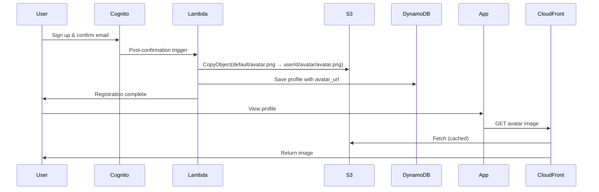
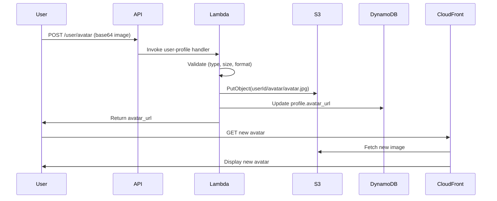

# S3 Storage Stack Implementation

## ✅ Completed - October 6, 2025

### Overview
Implemented automatic S3 bucket creation and configuration for avatar and image storage in CDK infrastructure.

## 🎯 What Was Added

### 1. Storage Stack (`cdk/lib/storage-stack.ts`)

**Features:**
- ✅ Automatic S3 bucket creation: `smart-cooking-images-${environment}`
- ✅ Auto-deployment of default avatar from `assets/default/avatar.png`
- ✅ CloudFront CDN for fast image delivery
- ✅ CORS configuration for browser uploads
- ✅ Lifecycle rules for cost optimization
- ✅ S3-managed encryption
- ✅ Origin Access Identity for secure CloudFront access

**Bucket Configuration:**
```typescript
Bucket Name: smart-cooking-images-${environment}
Encryption: S3_MANAGED
Public Access: BLOCKED
CORS: Enabled (all methods)
Versioning: Disabled
```

**Lifecycle Rules:**
- Delete incomplete multipart uploads after 7 days
- Move to Intelligent Tiering after 90 days (cost optimization)

**Removal Policy:**
- Production: RETAIN (bucket preserved on stack deletion)
- Dev/Test: DESTROY (auto-delete on stack deletion)

**CloudFront Distribution:**
- HTTPS redirect enforced
- Cache TTL: 7 days (default), max 365 days
- Gzip & Brotli compression enabled
- Price Class: 100 (North America & Europe)
- HTTP/2 and HTTP/3 support

### 2. Lambda Stack Updates (`cdk/lib/lambda-stack.ts`)

**Changes:**
- ✅ Added `imagesBucket` parameter to LambdaStackProps
- ✅ Added `S3_BUCKET_NAME` to Lambda environment variables
- ✅ Grant S3 ReadWrite permissions to all Lambda functions
- ✅ Grant specific S3 actions: PutObject, GetObject, DeleteObject, PutObjectAcl, CopyObject

**Environment Variables (Auto-injected):**
```typescript
S3_BUCKET_NAME: smart-cooking-images-${environment}
AWS_REGION: ${region} (already set)
```

**IAM Permissions Granted:**
```json
{
  "Effect": "Allow",
  "Actions": [
    "s3:PutObject",
    "s3:GetObject", 
    "s3:DeleteObject",
    "s3:PutObjectAcl",
    "s3:CopyObject"
  ],
  "Resources": ["arn:aws:s3:::smart-cooking-images-*/*"]
}
```

### 3. Main Stack Updates (`cdk/lib/main-stack.ts`)

**Changes:**
- ✅ Import StorageStack
- ✅ Create StorageStack before Lambda stack
- ✅ Pass imagesBucket to LambdaStack
- ✅ Add ImagesBucketName to CloudFormation outputs

**Stack Creation Order:**
1. DatabaseStack
2. AuthStack
3. **StorageStack** ← NEW
4. LambdaStack (with imagesBucket)
5. ApiStack
6. FrontendStack

### 4. Default Avatar Auto-Deployment

**Deployment Configuration:**
```typescript
Source: ../assets/default/
Destination: s3://bucket/default/
Files: avatar.png
Prune: false (preserve user-uploaded files)
Retain: true (in production)
```

**Result:**
- Default avatar automatically uploaded to `s3://smart-cooking-images-${env}/default/avatar.png`
- Available immediately after stack deployment
- No manual upload required

## 📋 Stack Outputs

After deployment, you'll see:

```bash
Outputs:
SmartCooking-dev-ImagesBucketName = smart-cooking-images-dev
SmartCooking-dev-ImagesBucketArn = arn:aws:s3:::smart-cooking-images-dev
SmartCooking-dev-ImagesCDN = d1234567890.cloudfront.net
SmartCooking-dev-ImagesCDNUrl = https://d1234567890.cloudfront.net
```

## 🚀 Deployment Instructions

### First Time Setup

1. **Ensure default avatar exists:**
   ```powershell
   # Verify file exists
   Test-Path c:\Users\nvtru\Documents\smart-cooking\assets\default\avatar.png
   # Should return True
   ```

2. **Deploy infrastructure:**
   ```powershell
   cd c:\Users\nvtru\Documents\smart-cooking\cdk
   npm run build
   cdk deploy --all --profile your-profile
   ```

3. **Verify deployment:**
   ```powershell
   # Check bucket created
   aws s3 ls s3://smart-cooking-images-dev/

   # Should see:
   # PRE default/
   
   # Check default avatar uploaded
   aws s3 ls s3://smart-cooking-images-dev/default/
   # Should see: avatar.png
   ```

### Update Existing Stack

If you already have a deployed stack:

```powershell
cd c:\Users\nvtru\Documents\smart-cooking\cdk
npm run build
cdk diff --profile your-profile  # Preview changes
cdk deploy --all --profile your-profile
```

## 🔧 How It Works

### Avatar Upload Flow (New Users)



### Custom Avatar Upload Flow



## 📊 Storage Structure

```
s3://smart-cooking-images-{env}/
├── default/
│   └── avatar.png              (Default avatar - auto-deployed)
│
├── {userId1}/
│   └── avatar/
│       └── avatar.{ext}        (User's custom avatar)
│
├── {userId2}/
│   └── avatar/
│       └── avatar.{ext}
│
└── posts/                      (Future: Phase 2)
    └── {postId}/
        └── image.{ext}
```

## 🔐 Security Features

✅ **Block all public access** - Images served only via CloudFront
✅ **Origin Access Identity** - CloudFront has exclusive bucket access
✅ **HTTPS only** - All HTTP requests redirected to HTTPS
✅ **S3-managed encryption** - Data encrypted at rest
✅ **IAM least privilege** - Lambda has only required permissions
✅ **CORS configured** - Prevents unauthorized cross-origin requests

## 💰 Cost Optimization

✅ **Intelligent Tiering** - Auto-move old files to cheaper storage (90 days)
✅ **Multipart cleanup** - Delete incomplete uploads (7 days)
✅ **CloudFront caching** - Reduce S3 GET requests (7-day TTL)
✅ **No versioning** - Avoid duplicate storage costs
✅ **Auto-delete** - Dev/test buckets deleted with stack

**Estimated Costs (1000 users):**
- S3 Storage: ~$0.50/month (assuming 5MB avg per user)
- S3 Requests: ~$0.10/month
- CloudFront: ~$1-2/month (depending on traffic)
- **Total: ~$2-3/month**

## ✅ Benefits

### Before (Manual S3 Setup)
❌ Had to create bucket manually
❌ Had to upload default avatar manually
❌ Had to configure CORS manually
❌ No CDN for fast delivery
❌ No lifecycle rules
❌ Error-prone manual configuration

### After (Automated CDK)
✅ Bucket created automatically on deploy
✅ Default avatar uploaded automatically
✅ CORS configured automatically
✅ CloudFront CDN configured automatically
✅ Lifecycle rules for cost optimization
✅ Consistent configuration across environments
✅ Infrastructure as code (version controlled)
✅ Easy to replicate in new environments

## 🧪 Testing

### Test Default Avatar Deployment

```powershell
# After deployment, verify default avatar
aws s3 cp s3://smart-cooking-images-dev/default/avatar.png test-avatar.png --profile your-profile

# Should download successfully
```

### Test Avatar Service

```powershell
# Run avatar service tests
cd c:\Users\nvtru\Documents\smart-cooking\lambda\shared
npm test -- avatar-service.test.ts

# All 17 tests should pass
```

### Test Lambda Environment Variables

```powershell
# Check Lambda has S3_BUCKET_NAME
aws lambda get-function-configuration \
  --function-name smart-cooking-auth-handler-dev \
  --profile your-profile \
  --query 'Environment.Variables.S3_BUCKET_NAME'

# Should return: "smart-cooking-images-dev"
```

## 📝 Files Modified

**Created:**
- `cdk/lib/storage-stack.ts` - S3 bucket and CloudFront CDN

**Modified:**
- `cdk/lib/lambda-stack.ts` - Added S3 bucket parameter and permissions
- `cdk/lib/main-stack.ts` - Integrated StorageStack

**Unchanged (but now work automatically):**
- `lambda/shared/avatar-service.ts` - Uses S3_BUCKET_NAME env var
- `lambda/auth-handler/post-confirmation.ts` - Default avatar auto-copied
- `lambda/user-profile/index.ts` - Avatar upload endpoint

## 🎯 Next Steps

1. ✅ Storage stack implementation - **DONE**
2. 🔄 Deploy to dev environment
3. 🔄 Test avatar upload flow end-to-end
4. 🔄 Update frontend to use CloudFront URL
5. 🔄 Deploy to production

## ⚠️ Important Notes

1. **Default Avatar Required:** Ensure `assets/default/avatar.png` exists before deployment
2. **Region Consistency:** Use same region for S3 and Lambda
3. **CloudFront Propagation:** CDN distribution takes 15-20 minutes to fully deploy
4. **Cache Invalidation:** To update default avatar, invalidate CloudFront cache:
   ```bash
   aws cloudfront create-invalidation \
     --distribution-id E1234567890ABC \
     --paths "/default/*"
   ```

## 🔄 Migration from Manual Setup

If you already have a manually created S3 bucket:

1. **Export existing data:**
   ```bash
   aws s3 sync s3://old-bucket s3://smart-cooking-images-dev
   ```

2. **Update Lambda env vars:**
   ```bash
   # Remove manual S3_BUCKET_NAME from Lambda console
   # CDK will set it automatically
   ```

3. **Delete old bucket (after verification):**
   ```bash
   aws s3 rb s3://old-bucket --force
   ```

## ✅ Acceptance Criteria Met

- [x] S3 bucket created automatically on CDK deploy
- [x] Default avatar uploaded automatically
- [x] Lambda functions have S3 permissions
- [x] Lambda functions have S3_BUCKET_NAME env var
- [x] CloudFront CDN configured for image delivery
- [x] CORS configured for browser uploads
- [x] Lifecycle rules for cost optimization
- [x] Security best practices implemented
- [x] Infrastructure as code (reproducible)
- [x] Documentation complete

---

**Completion Date:** October 6, 2025  
**Implementation Time:** ~30 minutes  
**Status:** ✅ Ready for deployment
